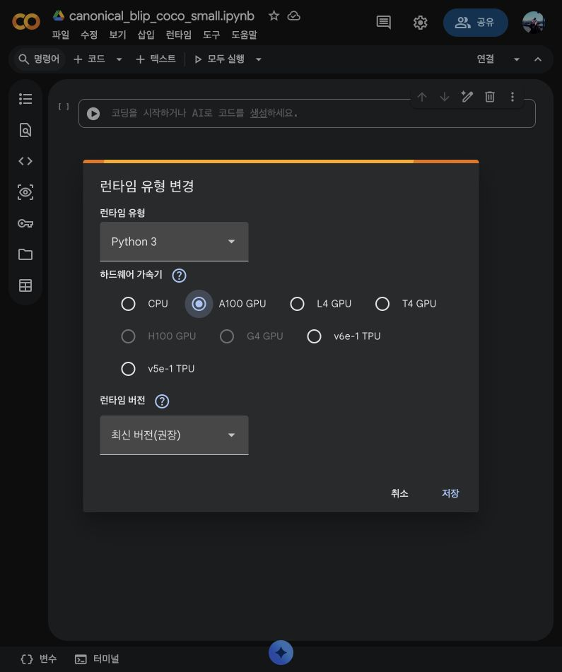
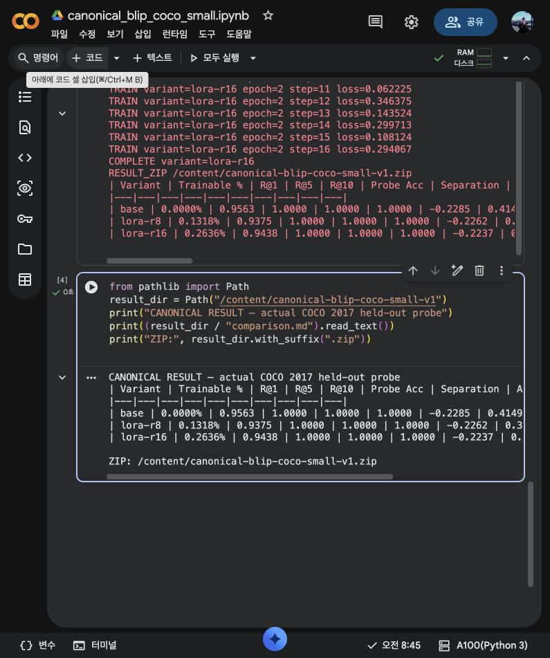
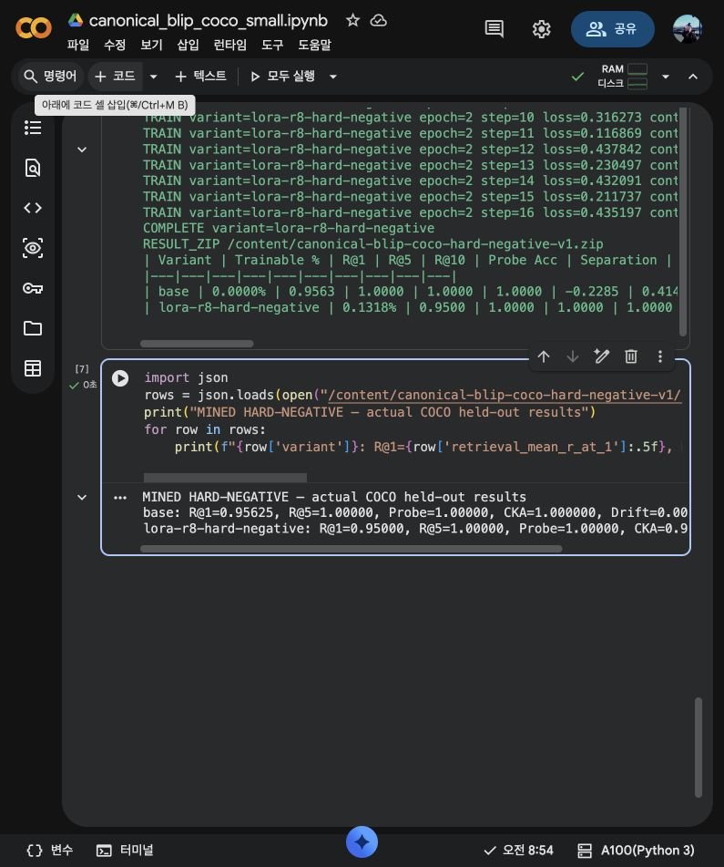
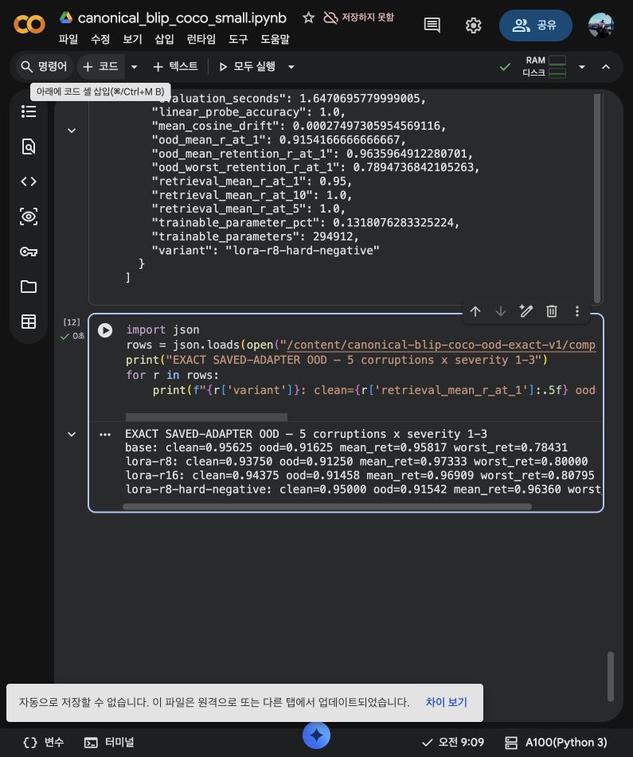
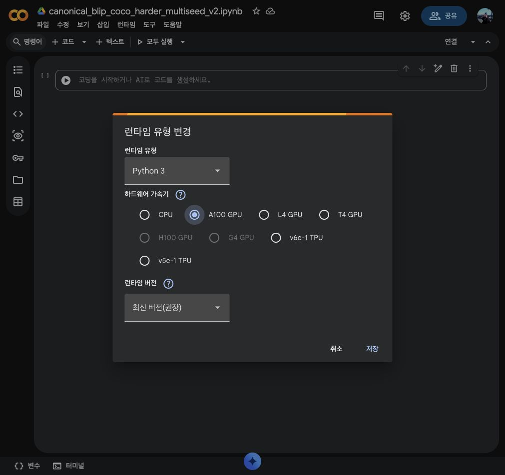
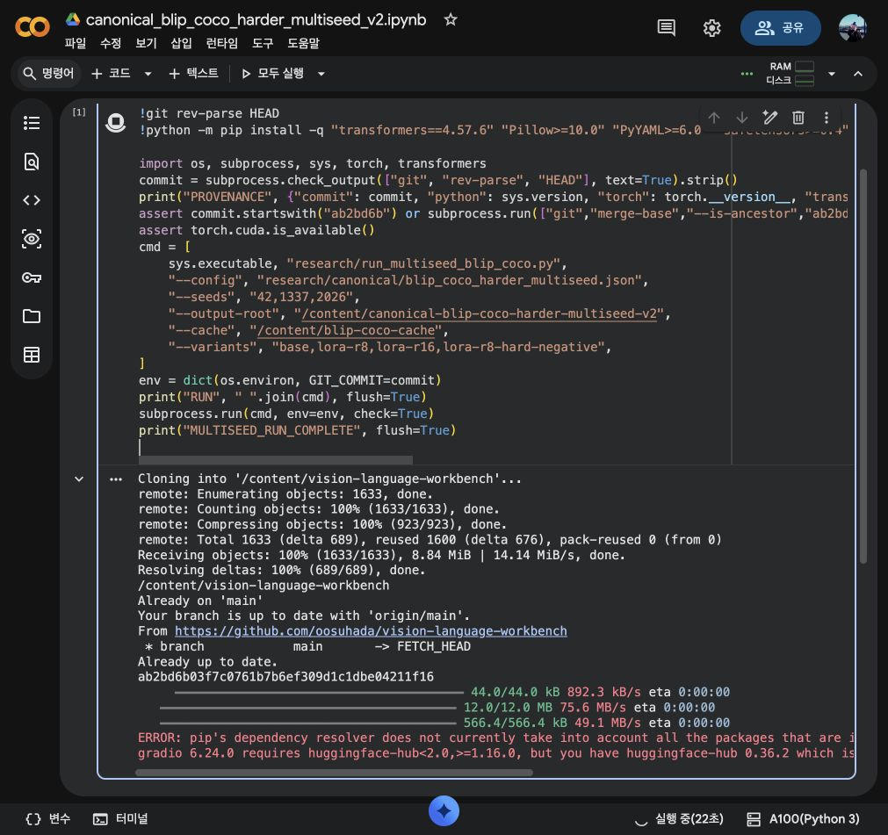
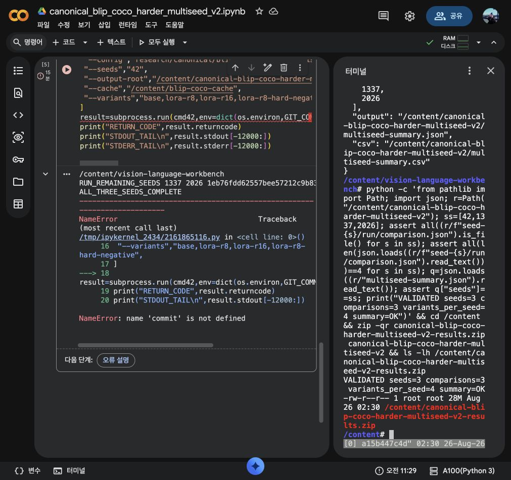
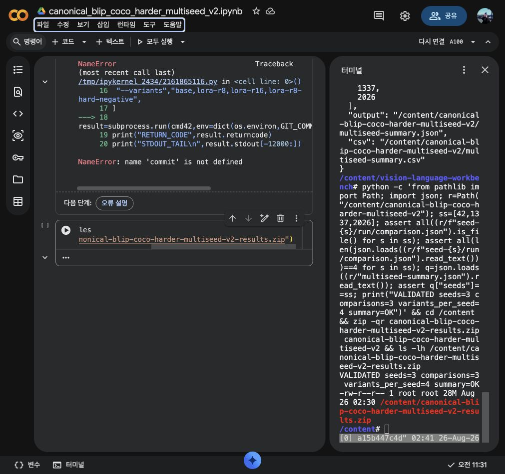

# Vision Language Workbench — Reproducible Vision-Language Research

Vision Language Workbench keeps the proven LAVIS model, processor, dataset,
task, runner, training, and evaluation code intact while adding a research
layer for reproducible representation analysis, LoRA experiments,
hard-negative training and clean/OOD comparison.

Vision Language Workbench는 검증된 LAVIS의 model, processor, dataset, task,
runner, training, evaluation 구현을 그대로 활용하면서 **representation 분석,
LoRA 실험, hard-negative 학습, clean/OOD 비교를 재현 가능하게 연결하는
vision-language research workbench**입니다.

The project does not reimplement BLIP, BLIP-2, ALBEF or CLIP. It treats the
existing model stack as the execution engine and focuses on experiment design,
measurement, provenance and research interpretation.

이 프로젝트는 BLIP, BLIP-2, ALBEF, CLIP을 다시 구현하지 않습니다. 기존
모델 스택을 execution engine으로 사용하고, 그 위에 실험 설계·측정·provenance·
연구 해석을 추가합니다.

## Overview / 개요

The workbench is organized around four research questions.

이 워크벤치는 다음 네 가지 연구 질문을 중심으로 구성됩니다.

- **Ⅰ Measure** — how well does the pretrained/fine-tuned model retrieve and separate held-out examples?<br>
  pretrained/fine-tuned 모델이 held-out sample을 얼마나 잘 retrieval하고 representation을 분리하는가?
- **Ⅱ Adapt** — how do LoRA rank/target policies change performance with a bounded trainable-parameter budget?<br>
  제한된 trainable parameter budget에서 LoRA rank/target policy가 성능을 어떻게 바꾸는가?
- **Ⅲ Stress** — what happens under mined hard negatives and image corruptions such as blur, noise and occlusion?<br>
  mined hard negative와 blur/noise/occlusion 같은 image corruption에서 어떤 변화가 나타나는가?
- **Ⅳ Trace** — can the exact experiment, checkpoint lineage and downstream evaluation be reconstructed later?<br>
  실험·checkpoint lineage·downstream evaluation을 나중에도 정확히 재구성할 수 있는가?

## Problem / 문제

Small vision-language fine-tuning experiments are easy to run but surprisingly
easy to misread: a higher training score may hide clean retrieval regression,
relative OOD retention can improve from a weaker clean baseline, and a
single-seed hard-negative gain may disappear when the candidate pool changes.

소규모 vision-language fine-tuning은 실행 자체는 쉽지만 해석을 잘못하기
쉽습니다. Training score가 좋아져도 clean retrieval은 떨어질 수 있고,
낮아진 clean baseline 때문에 상대 OOD retention만 좋아 보일 수 있으며,
single-seed hard-negative 개선은 candidate pool이 바뀌면 사라질 수 있습니다.

This workbench makes those trade-offs explicit by keeping data allocation,
training policy, representation movement, OOD stress and downstream evaluation
in one reproducible lineage.

이 워크벤치는 data allocation, training policy, representation 변화, OOD stress,
downstream evaluation을 하나의 reproducible lineage로 연결해 이러한 trade-off를
명확하게 드러냅니다.

## Research workflow / 연구 워크플로

This project is organized around a reproducible research workflow rather than a
graphical product surface. Experiments move from planning to representation
analysis, hard-negative research, measured reports, and downstream evaluation.

이 프로젝트는 그래픽 제품 화면이 아니라 **재현 가능한 연구 워크플로**를
중심으로 구성됩니다. 실험 계획에서 시작해 표현 공간 분석, hard-negative
연구, 실측 리포트, downstream evaluation으로 이어집니다.

### 1. Experiment planning / 실험 계획

```bash
vl-workbench plan experiments/clip-coco.yaml
vl-workbench sweep-plan experiments/clip-coco-retrieval-sweep.yaml
```

### 2. Representation analysis / 표현 공간 분석

```bash
vl-workbench extract-features probes.jsonl \
  --model-name blip_feature_extractor --model-type base \
  --mode image --output artifacts/blip-base-image.npz

vl-workbench probe artifacts/blip-base-image.npz
vl-workbench drift artifacts/base.npz artifacts/lora-r8.npz
```

### 3. Hard-negative research / Hard-negative 연구

```bash
vl-workbench hard-negatives artifacts/images.npz \
  --candidates artifacts/text.npz \
  --policy different-id --top-k 10
```

### 4. Canonical measured report / Canonical 실측 리포트

The generated result directories contain seed-level configs, comparison JSON,
paired statistics, OOD summaries and research lineage instead of only terminal
logs.

생성된 result directory에는 단순 terminal log가 아니라 seed별 config,
comparison JSON, paired statistics, OOD summary, research lineage가 함께
남습니다.

[`results/canonical-blip-coco-harder-multiseed-v2`](results/canonical-blip-coco-harder-multiseed-v2)

## Current capabilities / 현재 기능

| Capability / 기능 | Current implementation / 현재 구현 |
|---|---|
| Experiment orchestration / 실험 실행 | YAML/JSON manifests, deterministic command planning, sweeps, provenance ledger |
| Representation research / 표현 분석 | frozen snapshots, ridge linear probe, anisotropy, class separation, CKA, cosine drift |
| LoRA research / LoRA 연구 | target/rank policy, trainable-parameter budget, generic `nn.Linear` injection |
| Hard-negative learning / Hard-negative 학습 | embedding mining → retrieval dataset → BLIP margin-loss training |
| OOD evaluation / OOD 평가 | lazy blur/noise/JPEG/low-light/occlusion corruption, severity control |
| Reproducibility / 재현성 | pinned model revision, seed-level manifests, SHA-256 artifacts, cross-repo lineage |

## Research loop / 연구 루프

```text
LAVIS / pretrained BLIP
        ↓
deterministic COCO allocation
        ↓
Base / LoRA r8 / LoRA r16 / LoRA r8 + hard negative
        ↓
representation snapshots + retrieval metrics
        ↓
OOD corruption evaluation
        ↓
multimodal-eval-workbench
        ↓
calibration + paired statistics + Pareto / replication analysis
```

The loop deliberately separates **training evidence** from **evaluation
interpretation**. Vision Language Workbench owns the measured model artifacts;
Multimodal Eval Workbench owns calibration, statistical comparison and model
selection analysis.

이 루프는 **학습 근거**와 **평가 해석**을 의도적으로 분리합니다. Vision
Language Workbench는 measured model artifact를 담당하고, Multimodal Eval
Workbench는 calibration, 통계 비교, model selection 분석을 담당합니다.

## Quick start / 빠른 시작

Create a manifest / manifest 작성:

```yaml
name: clip-coco-retrieval-eval
mode: evaluate
cfg_path: projects/clip/exp_coco_ret_eval.yaml
options:
  run.num_workers: 4
tags:
  - retrieval
  - clip
```

Inspect the exact command without launching a model / 모델을 로드하지 않고 실행 계획 확인:

```bash
vl-workbench plan experiments/clip-coco.yaml
```

Execute the same plan and record it / 동일 계획 실행 및 provenance 기록:

```bash
vl-workbench run experiments/clip-coco.yaml
```

Review recent execution provenance / 최근 실행 이력 확인:

```bash
vl-workbench history --limit 10

# expand 4 concrete LAVIS runs without writing duplicate scripts
vl-workbench sweep-plan experiments/clip-coco-retrieval-sweep.yaml

# optionally materialize the variants as ordinary manifests
vl-workbench sweep-materialize experiments/clip-coco-retrieval-sweep.yaml

# inspect the output directory declared by the underlying LAVIS config
vl-workbench artifacts experiments/blip-caption-resume-example.yaml

# continue training from the newest checkpoint without hand-editing LAVIS YAML
vl-workbench resume-plan experiments/blip-caption-resume-example.yaml
```

The ledger stores only compact run metadata under `artifacts/`; large model
outputs remain outside Git history.

`artifacts/`에는 compact run metadata만 저장하고 큰 model output은 Git
history에 넣지 않습니다.

## Measured results / 실측 결과

### Experiment evidence / 실험 증거

This repository now contains two real-data canonical studies, not only local
or synthetic validation. The first study established the full workflow on a
Google Colab A100; the harder v2 study then repeated the experiment over three
seeds with a larger held-out retrieval pool and stronger occlusion stress.

이 레포에는 local/synthetic validation만 있는 것이 아니라 두 번의 실제
canonical study가 있습니다. 첫 실험은 Google Colab A100에서 전체 workflow를
검증했고, harder v2는 더 큰 held-out retrieval pool과 강한 occlusion 조건에서
3개 seed로 반복했습니다.

The following screenshots are preserved from the first canonical A100 study
and are committed as experiment evidence rather than decorative assets.

아래 이미지는 제품 화면이 아니라 실제 A100 실행과 측정 과정을 보존한
**experiment evidence**입니다.

**A100 runtime selected**



**Measured Base / LoRA comparison**



**Mined hard-negative result**



**Exact-checkpoint OOD result**



The harder v2 run was also executed interactively in Colab on an
`NVIDIA A100-SXM4-40GB`. Four browser-captured checkpoints of that run are
preserved under the canonical result directory, covering runtime allocation,
active execution, three-seed validation/artifact packaging, and final runtime
deletion.

Harder v2 역시 `NVIDIA A100-SXM4-40GB` Colab에서 실행했으며, runtime 선택,
실험 실행, 3-seed 검증 및 artifact packaging, 최종 runtime 삭제까지 네 장의
브라우저 캡처를 canonical result directory에 보존했습니다.

**Harder v2: A100 runtime selected**



**Harder v2: experiment running**



**Harder v2: all three seeds validated and result ZIP prepared**



**Harder v2: paid runtime disconnected and deleted**



#### Harder v2 execution timeline / v2 실행 이력

| Stage | Evidence |
|---|---|
| A100 allocated | `NVIDIA A100-SXM4-40GB` recorded in the measured run manifests |
| Initial harder allocation failed | `dog: 81 available, 96 required` exposed an overly strict subset-selection assumption |
| Balanced allocation fixed | `b244cbe` assigns scarce classes first while preserving globally disjoint image IDs and the requested 128/256 split |
| Paid-GPU network idle reduced | `1eb76fd` parallelizes only image-cache downloads; experiment conditions remain unchanged |
| Seed completeness tooling | `b4e0b6c` verifies all three seeds and computes paired `r8+HN − r8` statistics |
| Seeds completed | `42`, `1337`, `2026`; 12 variant metrics and three `comparison.json` files |
| Canonical v2 published | `f86ab7f`; result ZIP SHA-256 `5fc52a37700b83c08c7ce53bd1f361f1699a8263a78b7c902f6465ab60905867` |
| Downstream evaluation linked | `a9281b3` records the source-to-evaluation lineage |

This sequence is part of the research result: bugs and performance fixes were
resolved without changing the declared seeds, model revision, train/probe
counts, optimizer budget, or evaluation conditions.

이 실행 이력 자체도 연구 결과의 일부입니다. 실제 실행 중 발견된 버그와 성능
문제를 수정했지만 선언된 seed, model revision, train/probe 수, optimizer budget,
evaluation condition은 변경하지 않았습니다.

### Harder multi-seed v2 / 더 어려운 3-seed 재현 실험

The larger canonical follow-up uses 128 training pairs, 256 held-out probe
pairs, seeds 42/1337/2026, and 17 OOD conditions including occlusion severity
4–5. Base retains the highest clean R@1 (0.85612 mean); r8 and r16 are lower on
all three seeds (0.84766 and 0.84701). LoRA r8 improves mean relative retention
to 0.88431 versus Base's 0.87951, but the paired n=3 CI crosses zero. Mined hard
negatives tie ordinary r8 on clean R@1 and add only +0.00084 mean OOD R@1, also
inconclusive at three seeds. CKA remains 0.99837–0.99954.

더 어려운 v2에서는 Base가 clean R@1 `0.85612`로 가장 높았고, LoRA r8/r16은
세 seed 모두에서 clean 성능이 낮았습니다. r8의 상대 retention은 높아졌지만
95% CI가 0을 포함했고, hard-negative는 ordinary r8의 clean R@1을 전혀
회복하지 못했습니다. Representation CKA는 여전히 `0.99837–0.99954`로 매우
높았습니다.

Full seed-level metrics, Student-t intervals, paired hard-negative deltas, and
occlusion severity 4–5 results are in
[`results/canonical-blip-coco-harder-multiseed-v2`](results/canonical-blip-coco-harder-multiseed-v2).

Seed별 metric, Student-t interval, paired hard-negative delta, occlusion
severity 4–5 상세 결과는 위 canonical v2 result directory에 저장되어 있습니다.

### First canonical study / 첫 canonical 실험

The first canonical study uses the real
[COCO 2017](https://cocodataset.org/#download) validation images and human
captions with the pretrained
[`Salesforce/blip-itm-base-coco`](https://huggingface.co/Salesforce/blip-itm-base-coco)
checkpoint. A deterministic, leakage-free subset contains 64 training pairs
and 80 held-out probe pairs across `person`, `car`, `dog`, and `cat`. Mean
retrieval recall is the average of image-to-text and text-to-image recall.

첫 canonical study는 실제 COCO 2017 validation image/caption을 사용하고,
`person`, `car`, `dog`, `cat` 네 class에서 64개 train pair와 80개 held-out
probe pair를 leakage 없이 구성했습니다. Retrieval recall은 image-to-text와
text-to-image의 평균입니다.

| Variant | Trainable parameters | Trainable % | Mean R@1 | Mean R@5 | Mean R@10 | Linear probe | Class separation | Anisotropy |
|---|---:|---:|---:|---:|---:|---:|---:|---:|
| Pretrained Base | 0 | 0.0000% | 0.95625 | 1.00000 | 1.00000 | 1.00000 | -0.22854 | 0.41491 |
| LoRA Q/V r=8 | 294,912 | 0.1318% | 0.93750 | 1.00000 | 1.00000 | 1.00000 | -0.22623 | 0.39830 |
| LoRA Q/V r=16 | 589,824 | 0.2636% | 0.94375 | 1.00000 | 1.00000 | 1.00000 | -0.22369 | 0.38666 |
| LoRA Q/V r=8 + mined hard negative | 294,912 | 0.1318% | 0.95000 | 1.00000 | 1.00000 | 1.00000 | -0.22647 | 0.39887 |

LoRA used identical data and budget for both ranks: 2 epochs, 16 optimizer
steps, batch size 8, learning rate `1e-4`, and a symmetric contrastive loss.
R@1 decreased by 0.01875 for r=8 and 0.01250 for r=16 versus Base; these are
the canonical outcomes and were not retuned. Fused-space CKA versus Base was
0.999953 (r=8) and 0.999850 (r=16), with mean cosine drift 0.000300 and
0.000862 respectively. The result indicates that this tiny Q/V-only update
slightly reduces retrieval R@1 while barely moving the held-out representation
space, although its image-to-text NLL improves from 1.16840 to 1.10865/1.06734.

두 LoRA rank는 동일한 data와 budget(2 epoch, 16 optimizer step, batch size 8,
learning rate `1e-4`, symmetric contrastive loss)을 사용했습니다. Base 대비
R@1은 r8에서 `-0.01875`, r16에서 `-0.01250`이었고 결과에 맞춘 재튜닝은 하지
않았습니다. CKA는 거의 1을 유지해 작은 Q/V update가 held-out representation을
크게 이동시키지 않았음을 보여줍니다.

For the hard-negative variant, the pretrained train embeddings mine one
nearest wrong caption per image (`different-id`; mean cosine 0.35994), and the
existing margin loss is added with margin 0.2 and weight 1.0 under the same r=8
budget. It recovers 0.01250 R@1 over ordinary r=8 but remains 0.00625 below
Base. Its 16-step mean hard-negative loss was 0.09550. No outcome-driven
hyperparameter retry was performed.

Hard-negative variant는 pretrained train embedding에서 image당 가장 가까운 오답
caption 하나를 mining하고 동일한 r8 budget에서 margin loss를 추가했습니다.
첫 canonical run에서는 ordinary r8 대비 R@1을 `+0.01250` 회복했지만 Base보다
`0.00625` 낮았으며, 결과를 보고 hyperparameter를 다시 조정하지 않았습니다.

The exact saved canonical adapters were then evaluated on five lazy image
corruptions at severity 1–3 (15 matched conditions, 80 samples each):

저장된 canonical adapter는 다섯 종류의 lazy image corruption을 severity 1–3으로
적용한 15개 matched condition에서 추가 평가했습니다.

| Variant | Clean R@1 | Mean OOD R@1 | Mean retention | Worst retention | Worst condition |
|---|---:|---:|---:|---:|---|
| Pretrained Base | 0.95625 | 0.91625 | 0.95817 | 0.78431 | occlusion s3 |
| LoRA Q/V r=8 | 0.93750 | 0.91250 | 0.97333 | 0.80000 | occlusion s3 |
| LoRA Q/V r=16 | 0.94375 | 0.91458 | 0.96909 | 0.80795 | occlusion s3 |
| LoRA Q/V r=8 + mined hard negative | 0.95000 | 0.91542 | 0.96360 | 0.78947 | occlusion s3 |

LoRA improves relative retention because it starts from a lower clean score,
but Base still has the highest absolute mean OOD R@1. Occlusion is materially
harder than blur, noise, JPEG, or low light for every variant. Clean
representations re-extracted from the saved adapters match the canonical NPZ
files exactly (maximum absolute difference 0.0).

LoRA는 낮은 clean score에서 시작하기 때문에 relative retention은 높아지지만
absolute mean OOD R@1은 Base가 가장 높았습니다. 모든 variant에서 occlusion이
가장 어려운 shift였고, 저장된 adapter를 다시 로드해 추출한 representation은
canonical NPZ와 최대 절대 차이 `0.0`으로 일치했습니다.

This is an actual A100/bfloat16 run, not a synthetic smoke test. Its pinned
environment, sample IDs, confidence records, and representation NPZ files are
stored under [`results/canonical-blip-coco-small-v1`](results/canonical-blip-coco-small-v1).

이 결과는 synthetic smoke test가 아니라 실제 A100/bfloat16 실험입니다. Pinned
environment, sample ID, confidence record, representation NPZ는 첫 canonical
result directory에 보존되어 있습니다.

Search bundled LAVIS configs without importing any heavyweight model package:

Heavyweight model package를 import하지 않고 bundled LAVIS config를 검색할 수
있습니다.

```bash
vl-workbench catalog blip2 --kind model
vl-workbench catalog retrieval --kind project
```

This catalog is filesystem-based, so it stays fast and does not trigger checkpoint
downloads or GPU initialization.

The underlying execution still goes through the original LAVIS entrypoints:
`train.py` and `evaluate.py`.

Catalog는 filesystem 기반이라 checkpoint download나 GPU initialization을
발생시키지 않습니다. 실제 training/evaluation 실행은 기존 LAVIS entrypoint인
`train.py`, `evaluate.py`를 그대로 사용합니다.

## Representation research / 표현 공간 연구

Intermediate LAVIS representations can be captured as reusable NumPy snapshots
and analyzed without repeatedly loading model weights. The extractor calls the
bundled model's existing `extract_features()` implementation rather than
recreating an encoder.

LAVIS 중간 representation은 재사용 가능한 NumPy snapshot으로 저장할 수
있으며, 매번 모델 weight를 다시 로드하지 않고 분석할 수 있습니다. Extractor는
encoder를 새로 구현하지 않고 포함된 모델의 기존 `extract_features()`를 그대로
사용합니다.

Probe data is JSONL with stable ids and optional labels:

Probe 데이터는 stable id와 선택적 label을 갖는 JSONL 형식입니다.

```json
{"id":"dog-001","image":"images/dog.jpg","text":"a black dog running","label":"dog"}
{"id":"cat-001","image":"images/cat.jpg","text":"a tabby cat sitting","label":"cat"}
```

```bash
vl-workbench extract-features probes.jsonl \
  --model-name blip_feature_extractor \
  --model-type base \
  --mode image \
  --pooling cls \
  --output artifacts/blip-base-image.npz

vl-workbench probe artifacts/blip-base-image.npz
```

`extract-features` also accepts `--checkpoint`, allowing the identical probe
set to be captured before and after fine-tuning. `probe` reports frozen ridge
linear-probe accuracy, within-class cosine cohesion, between-class centroid
similarity, separation margin, and embedding anisotropy.

`extract-features`는 `--checkpoint`도 지원하므로 동일 probe set을 fine-tuning
전후에 추출할 수 있습니다. `probe`는 frozen ridge linear-probe accuracy,
class 내부 cosine cohesion, class centroid 간 similarity, separation margin,
embedding anisotropy를 계산합니다.

Compare a base snapshot against a fine-tuned checkpoint snapshot:

Base snapshot과 fine-tuned checkpoint snapshot은 다음처럼 직접 비교합니다.

```bash
vl-workbench drift \
  artifacts/blip-base-image.npz \
  artifacts/blip-finetuned-image.npz \
  --top-k 20
```

Drift analysis aligns samples by stable ids and reports linear CKA, per-sample
cosine drift, anisotropy change, class-separation change, class-centroid drift,
and the samples whose representations moved the most. CKA remains valid even
when the compared feature dimensions differ; direct cosine metrics are emitted
when dimensions match.

Drift 분석은 stable id로 sample을 정렬한 뒤 linear CKA, sample별 cosine drift,
anisotropy 변화, class separation 변화, class centroid drift, representation이
가장 크게 이동한 sample을 보고합니다. CKA는 비교 feature dimension이 달라도
사용할 수 있고, dimension이 같으면 direct cosine metric도 함께 계산합니다.

## Hard-negative mining / Hard-negative 마이닝

Use the same saved representation space to find examples the current model is
most likely to confuse:

동일하게 저장된 representation space에서 현재 모델이 가장 혼동하기 쉬운
example을 찾을 수 있습니다.

```bash
vl-workbench hard-negatives artifacts/blip-base-image.npz \
  --policy different-label \
  --top-k 5 \
  --output artifacts/hard-negatives.jsonl
```

For cross-modal contrastive mining, pass a second snapshot (for example image
anchors against text candidates) and use stable ids to exclude the true pair:

Cross-modal contrastive mining에서는 두 번째 snapshot을 candidate로 전달하고
(예: image anchor 대 text candidate), stable id를 이용해 실제 정답 pair를
제외합니다.

```bash
vl-workbench hard-negatives artifacts/images.npz \
  --candidates artifacts/text.npz \
  --policy different-id \
  --top-k 10
```

Mining is cosine-nearest-neighbor based and chunked to avoid allocating the
entire similarity matrix. The resulting JSONL can be consumed by later
fine-tuning data builders without changing the bundled LAVIS encoders.

Mining은 cosine nearest neighbor 기반이며 전체 similarity matrix를 한 번에
메모리에 만들지 않도록 chunk 단위로 처리합니다. 생성된 JSONL은 기존 LAVIS
encoder를 수정하지 않고 이후 fine-tuning data builder에서 사용할 수 있습니다.

## LoRA placement research / LoRA 배치 연구

The bundled xInstructBLIP code already uses PEFT LoRA for its LLM path. The
workbench adds a generic research policy for any LAVIS `nn.Linear` tree so LoRA
rank and placement are explicit experiment variables instead of fixed choices.

포함된 xInstructBLIP 코드는 이미 LLM 경로에 PEFT LoRA를 사용합니다. 이
워크벤치는 LAVIS의 임의 `nn.Linear` tree에 적용할 수 있는 generic research
policy를 추가해 LoRA rank와 placement를 고정값이 아니라 명시적인 실험 변수로
다룹니다.

Policies under `research/lora/` can target module suffixes or regular
expressions. `compare_lora_policies()` reports matched layers and exact adapter
parameter cost before training. `inject_lora()` installs zero-initialized
low-rank residuals while preserving the underlying LAVIS architecture.

`research/lora/`의 policy는 module suffix 또는 regular expression으로 target을
지정할 수 있습니다. `compare_lora_policies()`는 학습 전에 matched layer와 정확한
adapter parameter cost를 계산하고, `inject_lora()`는 기존 LAVIS architecture를
유지한 채 zero-initialized low-rank residual을 설치합니다.

This supports controlled studies such as Q/V rank 8 vs 16, projection-only
LoRA, or vision/Q-Former/LLM placement at a known trainable-parameter budget.

이를 통해 Q/V rank 8 대 16, projection-only LoRA, vision/Q-Former/LLM 위치별
LoRA처럼 trainable parameter budget이 명확한 controlled study를 수행할 수
있습니다.

## Hard negatives in the training loop / 학습 루프 연결

Mined neighbors can now be joined back to the original probe JSONL as concrete
LAVIS retrieval annotations with `materialize_hard_negative_annotations()`.
The registered `hard_negative_retrieval` dataset returns the normal positive
caption plus a mined `hard_negative_text` and its cosine hardness score.

Mined neighbor는 `materialize_hard_negative_annotations()`를 통해 원래 probe
JSONL에 실제 LAVIS retrieval annotation으로 다시 결합할 수 있습니다. 등록된
`hard_negative_retrieval` dataset은 positive caption과 함께 mined
`hard_negative_text`, cosine hardness score를 반환합니다.

`hard_negative_margin_loss()` then adds an explicit cosine ranking objective on
top of features produced by the existing LAVIS encoders. It supports one or
multiple negatives per image and optional hardness weighting, allowing studies
of random vs mined negatives without rewriting BLIP/ALBEF encoders.

`hard_negative_margin_loss()`는 기존 LAVIS encoder가 만든 feature 위에 명시적인
cosine ranking objective를 추가합니다. Image당 하나 또는 여러 negative와
선택적 hardness weighting을 지원하므로 BLIP/ALBEF encoder를 다시 구현하지 않고
random negative와 mined negative를 비교할 수 있습니다.

For end-to-end training, `blip_retrieval_hard_negative` subclasses the original
`BlipRetrieval`: the full upstream ITC/ITM forward pass is reused, then the
already-computed positive image/text embeddings are paired with the mined
negative caption and an extra weighted margin term is added to the loss. The
model config exposes `hard_negative_margin` and `hard_negative_weight` as normal
experiment variables.

End-to-end training에서는 `blip_retrieval_hard_negative`가 기존
`BlipRetrieval`을 상속합니다. Upstream ITC/ITM forward를 그대로 재사용한 뒤 이미
계산된 positive image/text embedding과 mined negative caption을 연결하고 weighted
margin term만 loss에 추가합니다. `hard_negative_margin`과
`hard_negative_weight`는 일반 experiment variable로 config에서 조정합니다.

## Architecture / 아키텍처

The repository keeps the original LAVIS execution path intact and places the
research orchestration, manifests, and analysis tooling in separate layers.

이 저장소는 기존 LAVIS 실행 경로를 그대로 유지하고, 연구 orchestration,
manifest, 분석 도구를 별도 계층으로 분리합니다.

```text
lavis/                  LAVIS models, datasets, processors, tasks, runners
projects/               LAVIS project configs retained for direct reuse
run_scripts/            Existing runnable training/evaluation examples
train.py                Original LAVIS training entrypoint
evaluate.py             Original LAVIS evaluation entrypoint
workbench/              Oosu experiment orchestration and provenance layer
experiments/            Small reusable manifests for this workbench
```
